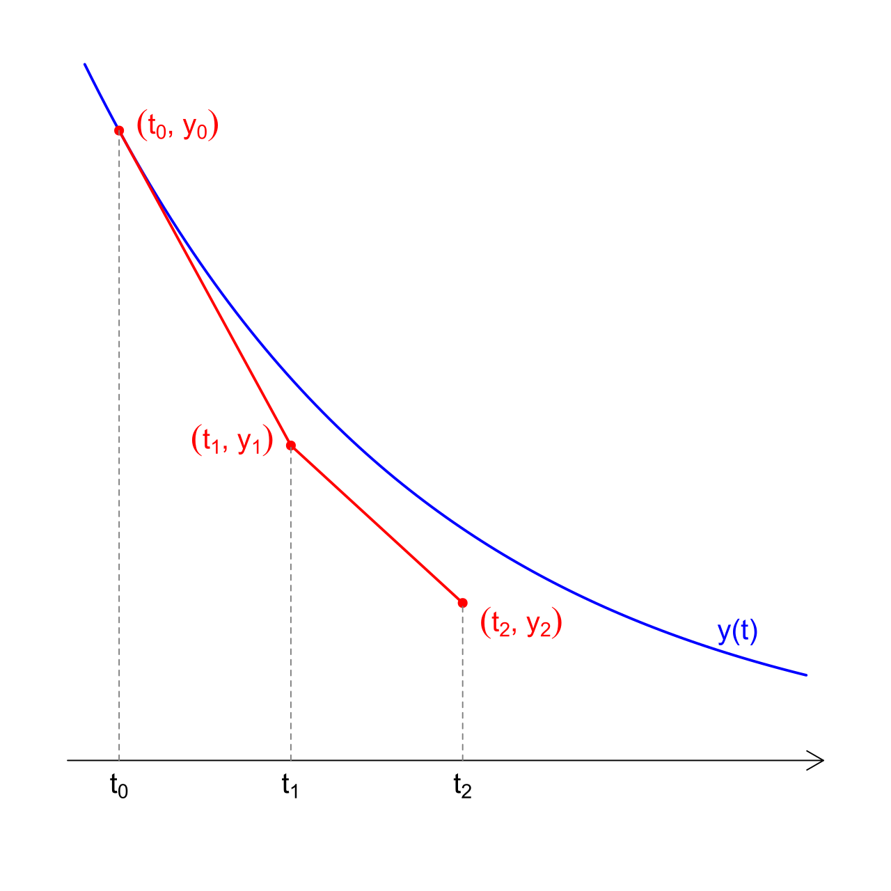

<!-- unterstützt LaTeX in md2pdf, claude.ai -->

## Euler-Verfahren

Das *Euler-Verfahren* ist das einfachste *numerische* Verfahren um gewöhnliche Differentialgleichungen (kurz: DG) zu lösen. Viele DG lassen sich nicht *analytisch*, also nicht exakt lösen. Dann kommen *numerische* Näherungsverfahren zum Einsatz. Computer nehmen uns dabei die Fleissarbeit ab. 

Die Idee des Euler-Verfahrens ist dabei eine sehr einfache: 

1. Löse die Differentialgleichung auf nach der 1. Ableitung der gesuchten Funktion $\dot{y}(t)=f(t,y)$.
2. Beginne bei einem gegebenen Startwert $(t_0|y_0)$. Berechne die Ableitung. Gehe einen kleinen Schritt in Richtung der Tangente, also in Richtung der Ableitung (siehe Abbildung). 
3. Berechne am neuen Ort wieder die Ableitung und gehe einen kleinen Schritt in ihre Richtung. 
4. Wiederhole das Verfahren, bis du zufrieden bist 😊. 

Damit kannst du den ungefähren Verlauf der gesuchten Funktion skizzieren. Je kleiner die Schritte gewählt werden, desto exakter (aber auch aufwendiger) ist die numerische Lösung. 

### Aufgaben

1. Im Thema Differentialgleichungen haben wir den Begriff **Richtungsfeld** behandelt. Suche ein Richtungsfeld aus deinen Unterlagen und durchlaufe das Euler-Verfahren anhand des Richtungsfeld für einen selbst gewählten Startwert. 
2. Öffne das Programm `sir.py`. Gehe es Zeile für Zeile durch und versuche es so gut wie möglich zu verstehen. 
   - Was macht das Programm? 
   - Was wird abgespeichert? 
   - Was wird graphisch dargestellt? 
   - Studiere den Abschnitt "Zeitschritt" bis zum Ende der Schleife. Was geschieht dort genau?
3. Exploriere: Wie verändert sich der Verlauf, wenn du die Startwerte oder die Parameter veränderst? Welchen Einfluss haben die Parameter *a* und *b* auf den Verlauf der Pandemie? 
4. Wie verändern die damals eingeführten Massnahmen - social distancing, Maske, Quarantäne, Impfung etc. - die Parameter *a* und *b*? 